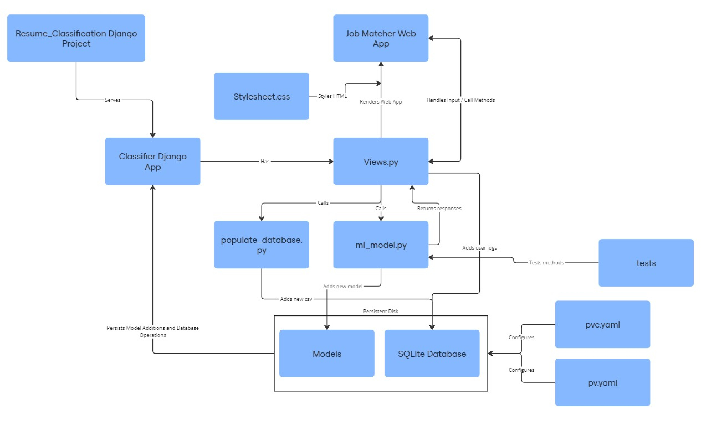

<div align="center">
    
</div>

**DISCLAIMER: THIS IS OUR SOURCE CODE FOR THE APP AND IT IS CONTAINERIZED AND DEPLOYED TO OUR GOOGLE CLOUD REPOSITORY. THE CODE CANNOT BE RUN LOCALLY. ONLY TESTS AS DESCRIBED BELOW. ACCESS OUR USER UI AND APP AT THE URL: http://34.13.144.154/ AND http://34.13.144.154/admin TO ACCESS ADMIN FUNCTIONALITY AND BE ABLE TO TEST ALL OF OUR FEATURES. USERNAME IS admin PASSWORD IS 12345.**

**Job Matcher** leverages machine learning to classify resumes and recommend the top five matching job roles based on textual analysis. The system integrates a user-friendly web interface with a backend prediction model and ensures efficient and accurate job-role mapping. Ideal for resume screening and career guidance tools.

## Purpose
This project aims to develop an AI-driven solution that helps job seekers find suitable roles by analyzing their experience and preferences. Traditional job searching often relies on keyword-based engines, resulting in inefficient matches. By addressing this gap, the system enhances job matching accuracy, reducing the time and effort for job seekers.

## File Structure



Our Django based Job Matcher app is composed of many individual parts and pieces. The figure above illustrates the most important ones. As seen above, our web app is an app served by the Django framework, the framework already handles many of the defaulted settings and configurations with small changes with local port numbers. Our actual app has a Views.py file that handles the user inputted actions on the front-end and renders the responses expected. Using a stylesheet and simple html files we render the proper pages on the front end of the Job Matcher. Any actions is then passed back to the Views.py file where it may call methods to train new models, which are handles by ml_model.py and sequentially added into a Models directory. Views.py may also call methods that include populating the database with new csv entries, which are handled by populate_database.py and also added to a already configured SQLite Database. Both the Models directory and SQLite database directory are mounted as persistent volumes hosted by Google Cloud. When the Job Matcher App is made into a new Docker Image, this data persists as the Docker Image always accesses the data via cloud and not locally. The pvc and pv yaml files configure the persistent disks for the google cloud to recieve. Finally the tests directory contains many python test files that are called by the CICD pipeline whenever a push to the branch is called, these tests call and expect certain responses from the ml_model.py file and other actions to see if any of the changes made may have broken anything. 

## Getting Started
This is the source code for our project and it only functions on the cloud. If you would like to copy our repo and run the tests for our system locally, complete the following steps:

1. Clone this repository with:  
```
git clone git@git.chalmers.se:courses/dit826/2024/group8.git
```
2. Set up the environment:
```
cd group8
conda env create -f environment.yml
conda activate resume_env
ENV DJANGO_TESTING=True
```
3. To run the tests also in the group8 directory do:
```
pytest
```
4. Can I run the entire app locally?:
```
No, our app is only available as a website at http://34.13.144.154/ 
All functionality is there, and to access admin functionality head to http://34.13.144.154/admin , the username is admin and the password is 12345. More info is available in our report.
```
## Contributers
<table>
  <tr>
    <td align="center" style="height: 180px; text-align: center;">
      
      <br/><sub><b>Hashem</b></sub><br>@hashemr
    </td>
    <td align="center" style="height: 180px; text-align: center;">
      
      <br/><sub><b>Mika</b></sub><br>@rannisto
    </td>
    <td align="center" style="height: 180px; text-align: center;">
      
      <br/><sub><b>Abdullahi</b></sub><br>@abdmah
    </td>
    <td align="center" style="height: 180px; text-align: center;">
      
      <br/><sub><b>Kai</b></sub><br>@rowley
    </td>
    <td align="center" style="height: 180px; text-align: center;">
      
      <br/><sub><b>Vilmer</b></sub><br>@vilmerh
    </td>
    <td align="center" style="height: 180px; text-align: center;">
      
      <br/><sub><b>Daniel</b></sub><br>@heuvel
    </td>
  </tr>
</table>

